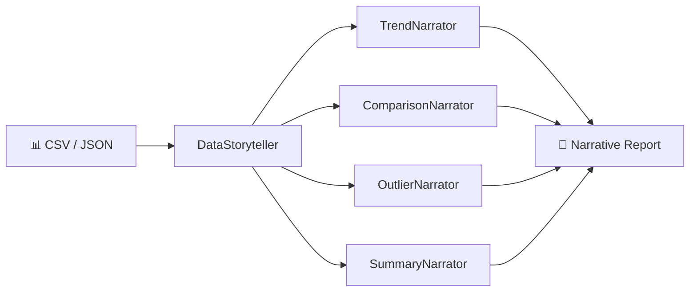

# DataNarrate

[](https://github.com/MukundaKatta/DataNarrate/actions/workflows/ci.yml)
[](https://python.org)
[](LICENSE)
[](https://github.com/astral-sh/ruff)

**Turn datasets into natural language narratives.** DataNarrate analyzes your data and generates human-readable stories covering trends, comparisons, outliers, and executive summaries — in the tone you choose.

---

## How It Works



## Installation

```bash
pip install -e .
```

## Quick Start

### Python API

```python
import pandas as pd
from datanarrate import DataStoryteller, NarrativeConfig, Tone

df = pd.DataFrame({
    "Quarter": ["Q1", "Q2", "Q3", "Q4"],
    "Revenue": [100_000, 115_000, 123_000, 142_000],
    "Expenses": [80_000, 82_000, 85_000, 84_000],
})

config = NarrativeConfig(tone=Tone.EXECUTIVE)
storyteller = DataStoryteller(config)

for sentence in storyteller.tell_story(df, period_col="Quarter"):
    print(sentence)
```

### CLI

```bash
datanarrate analyze sales.csv --tone executive --output report.md
datanarrate analyze data.json --tone casual
```

## Example Output

Given quarterly revenue data with an executive tone:

> **Key Insights — 4 records, 3 dimensions analyzed.**
>
> - Revenue: range 100.00K–142.00K, mean 120.00K.
> - Revenue grew 42.0% (Q1–Q4), signaling positive momentum.
> - Expenses held steady (Q1–Q4), indicating consistent performance.

## Tones

| Tone | Style |
|------|-------|
| `formal` | Professional, report-ready language |
| `casual` | Friendly, conversational descriptions |
| `executive` | Concise, action-oriented insights |

## Narrators

| Narrator | Purpose |
|----------|---------|
| `TrendNarrator` | Describes increasing, decreasing, or stable trends |
| `ComparisonNarrator` | Compares groups ("Product A outperformed Product B by 15%") |
| `OutlierNarrator` | Highlights anomalies ("March saw an unusual spike of 3x average") |
| `SummaryNarrator` | Executive summary of key statistics |

## Development

```bash
# Install dev dependencies
make dev

# Run tests
make test

# Lint
make lint
```

## Project Structure

```
src/datanarrate/
├── __init__.py      # Public exports
├── __main__.py      # CLI (Typer + Rich)
├── config.py        # Templates, tone settings, Pydantic config
├── core.py          # Narrator classes + DataStoryteller
└── utils.py         # Stats helpers, formatting
```

## Contributing

See [CONTRIBUTING.md](CONTRIBUTING.md) for guidelines.

## License

[MIT](LICENSE) — Copyright 2026 Officethree Technologies

---

Built by Officethree Technologies | Made with ❤️ and AI
