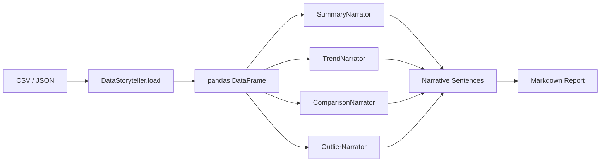

# Architecture

## Overview

DataNarrate follows a modular narrator pattern. Each narrator is responsible for one type of insight (trends, comparisons, outliers, summaries). The `DataStoryteller` orchestrator composes them into a cohesive report.

## Module Structure

```
src/datanarrate/
├── __init__.py      # Public API exports
├── __main__.py      # CLI entry-point (Typer)
├── config.py        # Tone enum, template bank, NarrativeConfig (Pydantic)
├── core.py          # Narrators + DataStoryteller orchestrator
└── utils.py         # Statistical helpers, number formatting
```

## Data Flow



## Key Design Decisions

1. **Template-based generation** — Each tone (formal, casual, executive) has its own template set so narratives can be tailored without changing logic.
2. **Pydantic config** — Runtime settings are validated via Pydantic, making it easy to serialize/deserialize from files or environment variables.
3. **Narrator composition** — Narrators are independent classes that can be used standalone or composed through `DataStoryteller`.
4. **Z-score outlier detection** — Simple, interpretable, and configurable via threshold.
